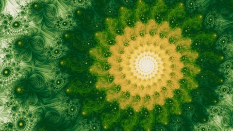

# Making Fractal Wallpapers

This repository is the source of the site at
[techmatt.github.io/fractals](https://techmatt.github.io/fractals/): an article about making
fractal wallpapers, and Mandelnaut Explorer, which draws any of them live in your browser. The
code that made the pictures is in a separate repository, linked below.

- **The site:** [techmatt.github.io/fractals](https://techmatt.github.io/fractals/), and
  [Mandelnaut Explorer](https://techmatt.github.io/fractals/explorer/)
- **Wallpapers to download:** [Wallpaper packs](https://techmatt.github.io/fractals/wallpaper-packs/),
  served from [this repository's releases](https://github.com/techmatt/fractals/releases)
- **The code that makes the pictures:** [fractal-wallpapers](https://github.com/techmatt/fractal-wallpapers)
- **[Run the pipeline yourself](https://techmatt.github.io/fractals/tools-and-data/run-it-yourself/):**
  a worked example of that code, with sample output from every stage

<p align="center">
  <a href="https://techmatt.github.io/fractals/explorer/index.html?v=4&f=julia&cx=-1.2583366697573282&cy=-0.03810995140056672&m=smooth_mean_angle&weight=0.55&x=-0.0939167613435858&y=-0.2012267774092059&w=0.17345963982562132&p=skyroads-blue-25&phase=0.788175"></a>
  <a href="https://techmatt.github.io/fractals/explorer/index.html?v=4&x=-0.056703850480536507&y=0.6689946803923973&w=0.0000000021132721900905024&p=Petal%20Dusk&phase=0.046639&level=band_autolevel/v1:0.2958367414372542,0.8390717419257583,1.1785094930375575,0.2958367414372542,0.8629886965307019"></a>
  <a href="https://techmatt.github.io/fractals/explorer/index.html?v=4&f=julia&cx=-1.2517612129804818&cy=0.038979112285470574&m=stripe&x=0.190964531525442&y=-0.027508345978564743&w=0.13834453039497419&p=Emerald%20Ingot"></a>
  <a href="https://techmatt.github.io/fractals/explorer/index.html?v=4&f=julia4&cx=0.4892207660373146&cy=-0.6507282511501382&m=threads&x=-0.1599467583852486&y=-0.6348190856721863&w=0.01057422759599882&p=abstract-wallpaper-backgrounds-hd&phase=0.827208"></a>
</p>

The article is a tutorial on making fractal wallpapers worth keeping: how an escape-time
fractal is drawn, how a search finds views worth looking at, how those views get their color,
and how a judge trained on my taste picks between the thousands of pictures that come out.
Every picture in it was made by the pipeline it describes.

Mandelnaut Explorer is the renderer the wallpapers were drawn with, compiled to WebAssembly and
running in your browser. You can pan and zoom any family the article covers, in any of its
rendering modes and about a thousand palettes, and copy a link to whatever is on screen. Most
pictures in the article, and every wallpaper in the gallery, open straight into it.

## How this relates to fractal-wallpapers

[fractal-wallpapers](https://github.com/techmatt/fractal-wallpapers) is the pipeline: the
Rust engine that draws the pictures, the search, the coloring, the judges, and the curation
that picked the gallery. This repository presents it. The explorer runs that engine compiled
to wasm, and the article links into fractal-wallpapers at the code each section is about.

Serving and checking the site needs only this repository. Redrawing the article's figures or
rebuilding the engine's wasm needs a fractal-wallpapers checkout beside this one.

## What is where

- `index.html`, `start-here.html`, `article/`: the article, one page per section
- `explorer/`: the explorer, its wasm modules, and the permalink format its links use
- `atlas/`: the atlas view shared by the explorer's Atlas tab and the Fractal atlases page
- `palettes/`: the palette library and the palette prompt
- `deep-zoom/`: the deep zoom videos
- `wallpaper-packs/`: the download page for the full-size packs
- `tools-and-data/`: the Tools and data page, its downloadable records, and Run the
  pipeline yourself, which hosts the walkthrough fractal-wallpapers writes
- `go/`: short links into the explorer
- `assets/`: the stylesheet, web-size images, and icons
- `builder/`: the Python program that writes the generated pages and figures, and checks the tree
- `docs/`: how the page-review loop is run
- `tools/judges-lab/`: the browser port of the judges, used by the explorer's Walk tab
- `examples/`: the four pictures above

## Building and serving it locally

The builder's output is committed, so serving needs only Python 3 and nothing built. Serve it
rather than opening files from disk, because browsers won't load the explorer's wasm over
`file://`:

```
python -m builder serve        # then open http://localhost:8000/index.html
```

To change the site, install the builder's two pinned tools (Python 3.13, as CI uses), then
rebuild and check:

```
python -m pip install -r builder/requirements.txt
python -m builder build        # rewrite the generated pages
python -m builder check        # hold the tree to what the builder would write
```

[`builder/README.md`](builder/README.md) has every command and what each check holds;
[`explorer/README.md`](explorer/README.md) has the explorer's wasm modules, its link format,
and its test suites. [`CLAUDE.md`](CLAUDE.md) is the rules this repository is held to,
written for coding agents.

## License

Code MIT ([LICENSE](LICENSE)); the wallpapers [CC BY 4.0](https://creativecommons.org/licenses/by/4.0/), credit Matt Fisher.
